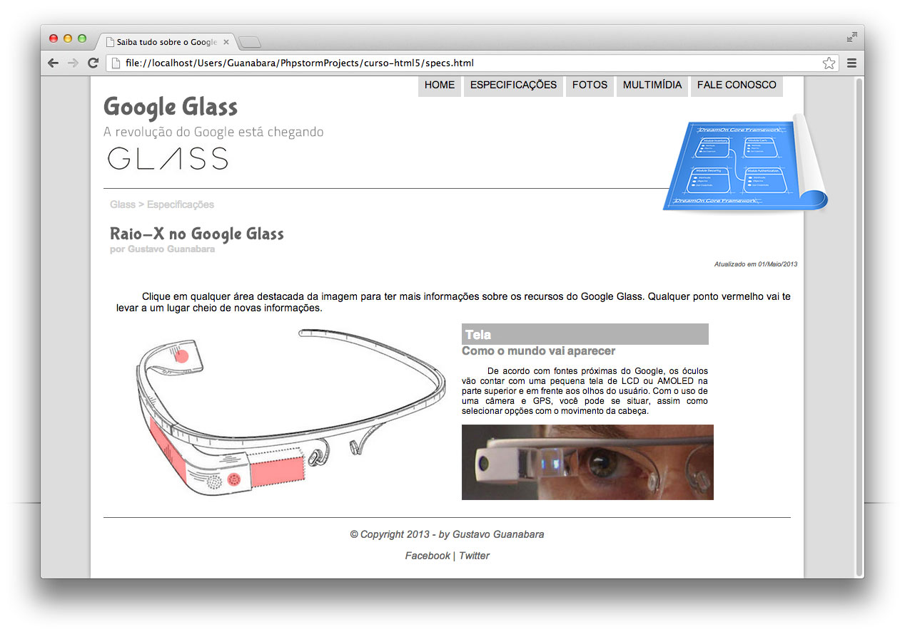

# ProjetoHtmlGuanabara 🖥️

    Nesse projeto criamos um site usando as tecnologias HTML e CSS3 + JavaScript , 
    onde tivemos introdução desde tags mais básicas até as mais avançadas de HTML5. 
    
    

        
    Introduzimos ao site conceitos como Iframes em  HTML5, multímidias de Aúdio, 
    Vídeos e criamos Formulários em HTML5.
    

    Utilizamos JavaScript com objetos e funções com integração ao o HTML5.

    Também introduzimos conceitos de formatação em código de cores, Fontes, Imagens, 
    Cabeçalho, Tabelas e Efeitos Visuais com CSS3.
    
    Esse projeto de criação de sites foi executado graças ao curso de 40 horas de 
    HTML5 do site http://cursoemvideo.com ministrado pelo Professor Gustavo Guanabara, 
    que conta com uma plataforma de acesso totalmente gratuita e de qualidade e com certificados.

 <a href="http://cursoemvideo.com" target="_blank"> 

